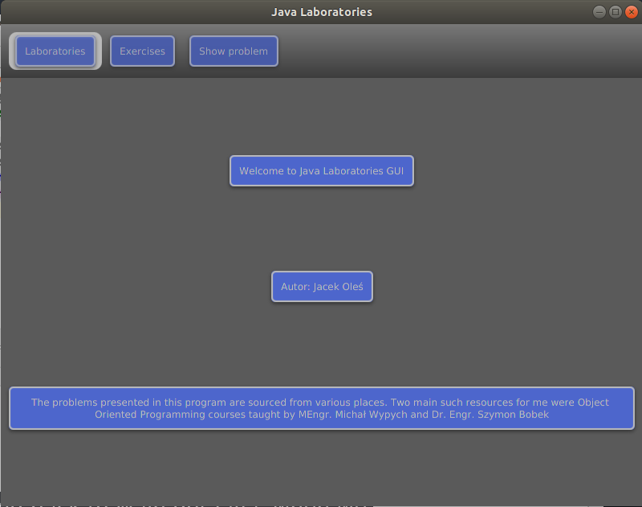
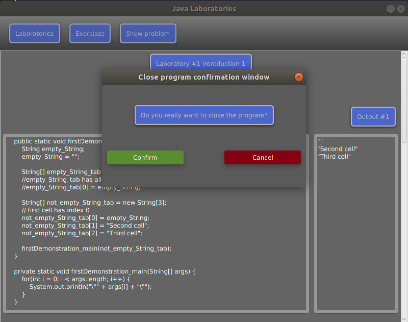
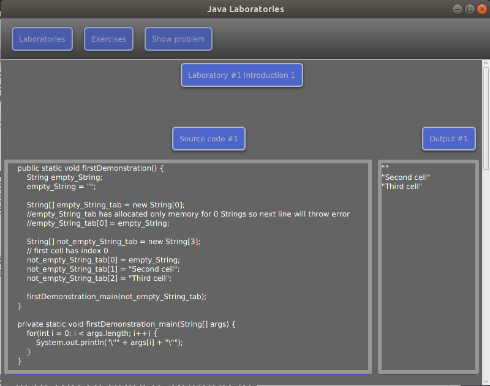
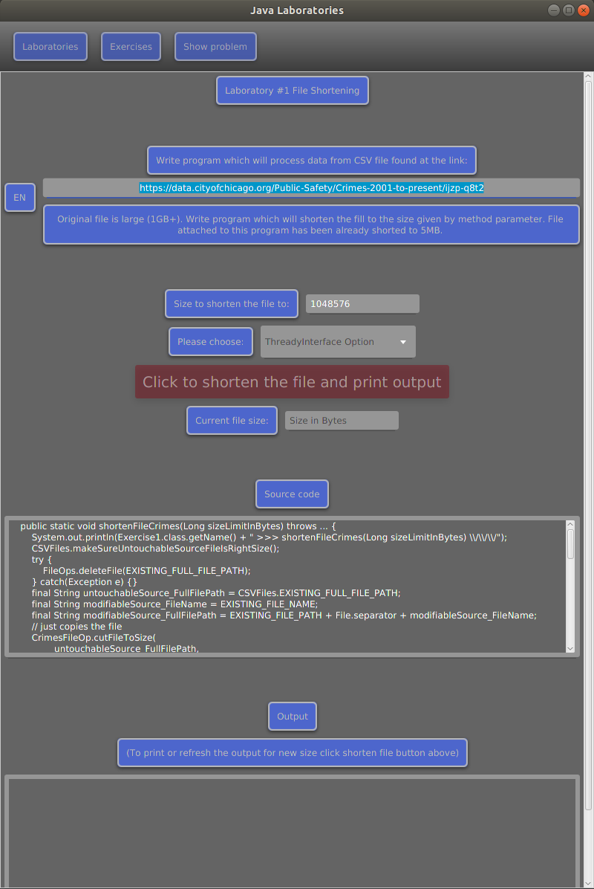
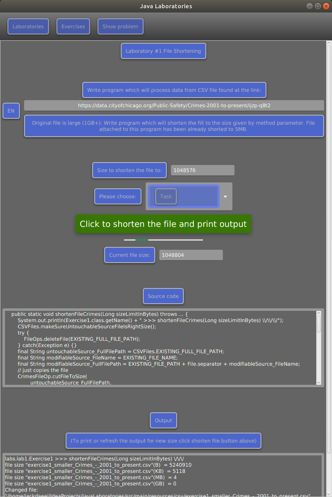
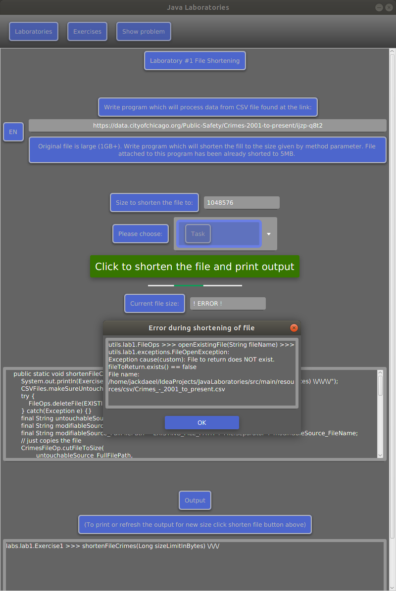

# JavaLaboratoriesGUI
Java project includes all of small projects from coding laboratories

## Screens:

##### Home window:

##### Exit Confirmation Pop Up Window [on close window (X button click)]:

##### Laboratory #1 Introduction Loading view [Laboratories > Laboratory #1 (> Exercises > Introduction)*]:
`* optional`  

##### Laboratory #1 Introduction [Laboratories > Laboratory #1 (> Exercises > Introduction)]:

##### Laboratory #1 File Shortening 1 [Laboratories > Laboratory #1 > Exercises > File Shortening]:
###### Not selected ThreadyInterface Option or Bad size to shorten the file to

###### Selected ThreadyInterface Option and Good size to shorten the file to (also loading new results - progress bar)

##### Error / Exception Pop Up Window [on button click inside Exercise 1 after manually removing the file]:

## Tech stack:
1. Java 11
2. Maven 3.6.0
3. JavaFX 11
4. JFoenix 9.0.8 

## How to run:
1. `git clone https://github.com/axal25/JavaLaboratoriesGUI.git`
1. `cd JavaLaboratoriesGUI`
    1. Run executable jar file:
        1. `java -jar target/JavaLaboratoriesGUI_complete_standalone.jar`
    1. Compile package before running executable jar file:
        1. `mvn clean package`
        1. `java -jar target/JavaLaboratoriesGUI_complete_standalone.jar`

## lab1
### Functionality
#### Various file operations 
* [location: laboratories.lab1.CrimesFileOp](https://github.com/axal25/JavaLaboratoriesGUI/blob/master/src/laboratories/lab1/CrimesFileOp.java)
* [location: utils.FilesOp](https://github.com/axal25/JavaLaboratoriesGUI/blob/master/src/utils/FilesOp.java)
* [changing file size (cutting it's contents) to smaller, set value - laboratories.lab1.CrimesFileOp.cutFileToSize](https://github.com/axal25/JavaLaboratoriesGUI/blob/master/src/laboratories/lab1/CrimesFileOp.java)
* [processing information in csv files: laboratories.lab1.Excercise1 or 2 or 3](https://github.com/axal25/JavaLaboratoriesGUI/tree/master/src/laboratories/lab1)
#### JUnit tests for classes: laboratories.lab1.CrimesFileOp, laboratories.utils.FilesOp 
* [location: laboratories.lab1.tests.CrimesFileOpTest](https://github.com/axal25/JavaLaboratoriesGUI/blob/master/src/laboratories/lab1/tests/CrimesFileOpTest.java)
* [location: utils.tests.FilesOpTest](https://github.com/axal25/JavaLaboratoriesGUI/blob/master/src/utils/tests/FilesOpTest.java)
#### Custom exceptions
* [location: laboratories.lab1.exceptions.*](https://github.com/axal25/JavaLaboratoriesGUI/tree/master/src/laboratories/lab1/exceptions)
* [location: utils.exceptions.*](https://github.com/axal25/JavaLaboratoriesGUI/tree/master/src/utils/exceptions)
#### Custom exceptions handling
* [location: utils.ExceptionMessageGenerator](https://github.com/axal25/JavaLaboratoriesGUI/blob/master/src/utils/ExceptionMessageGenerator.java)

### There are 2 ways to add JavaFX and JFoenix to your class path:
1. Add those libraries to your class path via IDE
2. Add those libraries to your program launch options via JVM launch options

### 1. Java Virtual Machine launch options

##### When you try to launch main.AppMain class using your IDE you should put those options inside "VM Options: " field
##### The only parameter you should modify in these lines is `--module-path ...` line.
   
--module-path /usr/share/openjfx/lib   
--add-modules javafx.controls   
--add-exports=javafx.graphics/com.sun.javafx.util=ALL-UNNAMED   
--add-exports=javafx.base/com.sun.javafx.reflect=ALL-UNNAMED   
--add-exports=javafx.base/com.sun.javafx.beans=ALL-UNNAMED  
--add-exports=javafx.graphics/com.sun.glass.utils=ALL-UNNAMED   
--add-exports=javafx.graphics/com.sun.javafx.tk=ALL-UNNAMED  
--add-modules com.jfoenix  
--add-exports javafx.controls/com.sun.javafx.scene.control.behavior=com.jfoenix  
--add-exports javafx.controls/com.sun.javafx.scene.control=com.jfoenix  
--add-exports javafx.base/com.sun.javafx.binding=com.jfoenix  
--add-exports javafx.graphics/com.sun.javafx.stage=com.jfoenix  
--add-exports javafx.graphics/com.sun.javafx.scene=com.jfoenix  
--add-exports javafx.base/com.sun.javafx.event=com.jfoenix   

###### Note: JFOENIX package is named "com.jfoenix" not "jfoenix".

## How to modify the path of my libraries
1. On my computer all of the javafx .jar files are located at: `/usr/share/java/`  
2. while their symbolic links are located at: `/usr/share/openjfx/lib`  
3. I have also copied `jfoenix` jar package to `/usr/share/java/` (where javafx .jars are)  
4. using command: `cp ~/Downloads/jfoenix-9.0.8.jar /usr/share/openjfx/lib/`  
5. and have created symbolic link inside `/usr/share/openjfx/lib` using command:  
6. `sudo ln -s /usr/share/java/jfoenix-9.0.8.jar /usr/share/openjfx/lib/jfeonix-9.0.8.jar`

### 2. Class path IDE
1. In IntelliJ go to:  
`File > Project Structure > Global Libraries > + > Java`
2. Find in file explorer .jar files for `JavaFX` libraries
3. [OPTIONAL] Change class Global Library name to something more meaningful like `JavaFX-11`
4. Repeat the process for `JFoenix` library
5. [OPTIONAL] In `File > Project Structure > Global Libraries`
    1. Right-click `JavaFX-11` and click `Add to modules` select module (this project) > OK > OK
    2. Repeat for `JFoenix`
6. Now you can run your main class without any JVM options