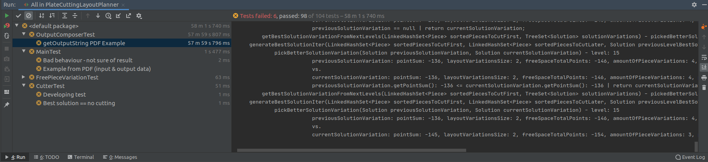

# PlateCuttingLayoutPlanner

## Theory 

### Sources:
 1. https://cs.stackexchange.com/questions/84990/algorithm-for-packing-various-shapes-inside-of-a-rectangle
    1. http://mimoza.marmara.edu.tr/~msakalli/cse706_12/SkienaTheAlgorithmDesignManual.pdf [17.9 Bin Packing - p. 595 (605)]
 
#### Problem
 Store all the items using the smallest number of bins
##### Problem type
 [NP-complete] Bin Packing (Cutting stock)
 
#### Solution
##### Solution type
 Heuristics instead of worst-case optimal algorithms
 
###### Constraints
 1. OBJECTS' SHAPE & SIZE 
    1. CUT PLATES (Pieces) - rectangles (or squares) of various sizes 
    fit into 
    1. PRE-CUT SHEET (Layout) - rectangle (or squares) of one size (given as parameter)
 1. ARBITRARY (ANY) OBJECTS ORIENTATION (object rotation is allowed)
 1. OFF-LINE - set of objects is known at the beginning 
    1. in opposition to ONLINE
        1. ONLINE - object arrive one after another, we have to deal with one before second arrives

##### Algorithm
1. Order items (needed plate cuts)
 
###### SOLUTION TIME COMPLEXITY:
 
 

The standard off-line heuristics for bin packing order the objects by size or shape and then insert them into bins. 
Typical insertion rules are: \
(1) select the first or leftmost bin the object fits in, \
(2) select the bin with the most room, \
(3) select the bin that provides the tightest fit, or \
(4) select a random bin.

Analytical  and  empirical  results  suggest  that first-fit decreasing is  the  best heuristic. 
Sort the objects in decreasing order of size, so that the biggest object is first and the smallest last. 
Insert each object one by one into the first bin that has room for it. 
If no bin has room, we must start another bin. 
In the case of one-dimensional bin packing, 
this can never require more than 22% more bins than necessary and usually does much better. 
First-fit decreasing has an intuitive appeal to it, for we pack the bulky objects first and hope that little objects can fill up the cracks.
First-fit decreasing is easily implemented inO(n*lg(n)+b*n) time, where b ≤ min(n, m) is the number of bins actually used. 
Simply do a linear sweep through the bins on each insertion. 
A fasterO(n*lg(n)) implementation is possible by using a binary tree to keep track of the space remaining in each bin.

### Still work in progress

### Test - getOutputString PDF Example


```java
			pickBetterSolutionVariation(Solution previousSolutionVariation, Solution currentSolutionVariation) - level: 1
 						previousSolutionVariation: Solution: null
 						vs.
 						currentSolutionVariation: pointSum: 16, layoutVariationsSize: 1, freeSpaceTotalPoints: -4, amountOfPieceVariations: 6, pieceVariationsTotalPoints: 20
 						previousSolutionVariation == null | return currentSolutionVariation;
 		getBestSolutionVariationFromNextLevels(LinkedHashSet<Piece> sortedPiecesToCutFirst, TreeSet<Solution> solutionVariations) - pickedBetterSolutionVariation: pointSum: 16, layoutVariationsSize: 1, freeSpaceTotalPoints: -4, amountOfPieceVariations: 6, pieceVariationsTotalPoints: 20
 		getBestSolutionVariationFromNextLevels(LinkedHashSet<Piece> sortedPiecesToCutFirst, LinkedHashSet<Piece> sortedPiecesToCutLater, TreeSet<Solution> solutionVariations) - for --------------
 cutter.getCurSolutionsChecked(): 1000013
 cutter.getBestSolution(): Solution{layoutVariations=TreeSet<LayoutVariation>{LayoutVariation{layout=Layout{id=0, width=10, height=10}, this.freeArea=4, points=16, pieceVariations=LinkedHashSet<PieceVariation>{PieceVariation{piece=Piece{id=7, width=4, height=2, points=1}, orientation=H, northEasternCoord=Coordinate{x=0, y=0}}PieceVariation{piece=Piece{id=0, width=6, height=6, points=9}, orientation=H, northEasternCoord=Coordinate{x=4, y=0}}PieceVariation{piece=Piece{id=2, width=2, height=5, points=5}, orientation=V, northEasternCoord=Coordinate{x=0, y=2}}PieceVariation{piece=Piece{id=1, width=7, height=4, points=3}, orientation=H, northEasternCoord=Coordinate{x=2, y=6}}PieceVariation{piece=Piece{id=5, width=2, height=3, points=1}, orientation=V, northEasternCoord=Coordinate{x=0, y=7}}PieceVariation{piece=Piece{id=6, width=2, height=4, points=1}, orientation=V, northEasternCoord=Coordinate{x=2, y=2}}}}}}
 cutter.getBestSolution().getPointSum(): 16
 ```

```java
cutter.getBestSolution(): 
    Solution{
        layoutVariations=TreeSet<LayoutVariation>{
            LayoutVariation{
                layout=Layout{id=0, width=10, height=10}, 
                this.freeArea=4, 
                points=16, 
                pieceVariations=LinkedHashSet<PieceVariation>{
                    PieceVariation{piece=Piece{id=7, width=4, height=2, points=1}, orientation=H, northEasternCoord=Coordinate{x=0, y=0}}
                    PieceVariation{piece=Piece{id=0, width=6, height=6, points=9}, orientation=H, northEasternCoord=Coordinate{x=4, y=0}}
                    PieceVariation{piece=Piece{id=2, width=2, height=5, points=5}, orientation=V, northEasternCoord=Coordinate{x=0, y=2}}
                    PieceVariation{piece=Piece{id=1, width=7, height=4, points=3}, orientation=H, northEasternCoord=Coordinate{x=2, y=6}}
                    PieceVariation{piece=Piece{id=5, width=2, height=3, points=1}, orientation=V, northEasternCoord=Coordinate{x=0, y=7}}
                    PieceVariation{piece=Piece{id=6, width=2, height=4, points=1}, orientation=V, northEasternCoord=Coordinate{x=2, y=2}}
                }
            }
        }
    } 
```